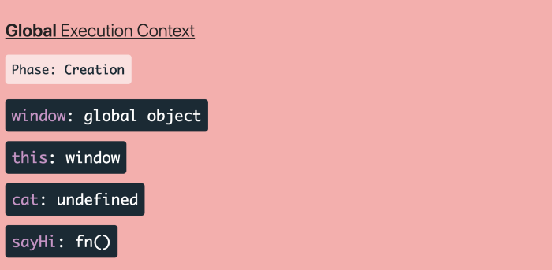
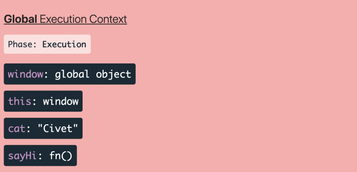
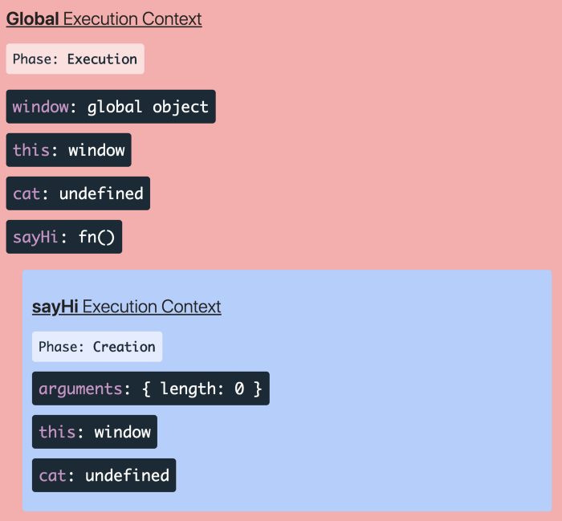

# JavaScript Hoisting 提升是什麼？


<div style={{display:"flex",justifyContent:"center",width:"100%"}}>


</div>

* 在 ES6 尚未流行前，大部分 JS 開發者都是使用 var 關鍵字做變數宣告，很多開發者在宣告函式時也比較習慣使用 function declaration 又稱作 function statement 做函式的宣告。

```javascript showLineNumbers
var cat = "Civet";

// function declaration || function statement

function sayHi(){
    var cat = "Doraemon";
    console.log("hello I'm " + cat);
}

sayHi();
```

* 而以上程式碼相信大家腦袋中早已有答案，我們在 Devtool 中將會看到字串 hello I'm Doraemon ，但如果今天的情況變成是以下程式碼？那結果會是如何呢？

```javascript showLineNumbers
var cat = "Civet";

// function declaration || function statement

function sayHi(){
    console.log("hello I'm " + cat);
    var cat = "Doraemon";
}

sayHi();
```

* 答案將會是 hello I'm undefined ，驚不驚喜，意不意外？
cat 的值竟然不是向外找的 Civet 也沒有錯誤訊息說明 ReferenceError: cat is not defined 取而代之的值卻是 undefined !
別緊張，通常一般教授 JS 的書籍會很貼心的先分解步驟給學者看，當然這裡也不意外。可以先想像上述的程式碼和下述的程式碼是等價的。

```javascript showLineNumbers
var cat = "Civet";

// function declaration || function statement

function sayHi(){
    var cat;
    console.log("hello I'm " + cat);
    cat = "Doraemon";
}

sayHi();
```

* 這樣看起來是不是相對合理多了呢！？
這也是為何用提升 ( Hoisting ) 這個詞來描述這種現象，從 sayHi 這個函式當中我們看見了 cat 這個變數被 ***“提”*** 早於函式一開始前就做宣告，但並沒有初始化，也就是賦予了這個變數記憶體位置卻沒有賦予它值。而 JS 在此種情況會給予該變數 undefined 的值。

* 但為什麼會發生提升 ( Hoisting ) 這種現象呢？
這就要說到 JS 在運行時，會有兩個階段

 1. 創建階段 ( creation phase )

 2. 執行階段 ( execution phase )

* 大家皆明白 JS 是由上而下一行一行的讀取程式碼，而在開始讀取第一行程式碼前，JS 會先進入創建階段，建立全域執行環境 (Global Execution Context)，為接下來要運行的 JS 程式碼做準備，以上方程式碼為例，在建立階段會做以下的準備。

<div style={{display:"flex",justifyContent:"center",width:"100%"}}>



</div>

* 會為變數 cat 先保留記憶體位置，以及用 function declaration 宣告的函式 sayHi 做記憶體分配，在此要注意的是這裏建立的 cat 並不是 sayHi 函式中的 cat，而是全域變數中的 cat 。
接著環境準備好後，JS 緊接著就會開始進入執行階段 ( execution phase ) ，執行第一行程式碼，也就是：

```javascript showLineNumbers
var cat = "Civet";
```

而此時全域變數 cat 就在這行程式碼被賦予了值 Civet 。

<div style={{display:"flex",justifyContent:"center",width:"100%"}}>



</div>

接著繼續向下執行…

```javascript showLineNumbers
function sayHi(){
    console.log("hello I'm " + cat);
    var cat = "Doraemon";
}

saiHi();
```

JS 遇見了第二個作用域 ( 別忘了JS 是以函式作為一等公民切分作用域的 )，
因此 JS 再次進入創建階段 開始進入建立局部區域執行環境 ( Local Execution Context ) ，這時並還沒有執行 sayHi 函式裡的任何一行程式碼，而是為了要執行 sayHi 做前置準備，JS 會將 sayHi 作用域裡的程式碼掃過一遍，看看有沒有使用 var 關鍵字做宣告的變數，並先分配給此變數記憶體，所以此時 cat 就佔了一席之地了，但尚未被初始化。


<div style={{display:"flex",justifyContent:"center",width:"100%"}}>



</div>


執行完創建階段後，就開始進入執行階段，先行執行了
console.log("hello I'm" + cat); 而此時局部變數 cat 仍然尚未賦值，
所以想當然就得到了 hello I'm undefined 的值啦！ＱＱ

* 而提升此種現象並非只出現在 var 關鍵字上，還會出現在上述的 function declaration 所宣告的函式上，所以如果遇見以下狀況別懷疑，是提升搞的鬼。明明就在還沒宣告前就 call sayGoodBye 為什麼還呼叫的到？原因就是 sayGoodBye 函式早已在建立全域執行環境 (Global Execution Context) 時，函式的內容已經做好了準備。

```javascript showLineNumbers
sayGoodBye();

function sayGoodBye(){
    console.log("Bye Bye");
}
// output: Bye Bye
```

以上是我個人對於提升的見解，如果有誤，歡迎告訴我，我會盡快的更改有誤的內容，並且謝謝你讓我有機會更加的進步。

參考資料：
[**JavaScript Visualizer**](https://ui.dev/javascript-visualizer/)

大家可以到上面這個網站模擬看看，很好玩的，不玩會後悔。

<div style={{display:"flex",justifyContent:"center",width:"100%"}}>


</div>


[**我知道你懂 hoisting，可是你了解到多深？**](https://blog.techbridge.cc/2018/11/10/javascript-hoisting/)<br/>
[**Javascript Execution Context 簡介**](https://medium.com/digital-dance/javascript%E5%9F%B7%E8%A1%8C%E7%92%B0%E5%A2%83-execution-context-%E7%B0%A1%E4%BB%8B-672185ed6bf4)