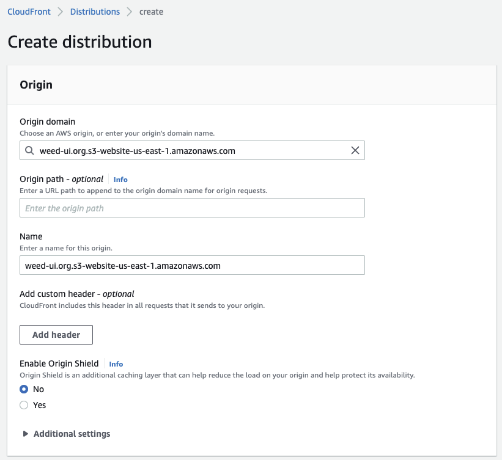

import Zoom from 'react-medium-image-zoom';

# 使用 AWS cloud services 架設 SSG 站

<Zoom>


</Zoom>

> 前言

此篇文章將從註冊網域到將網站部署到 AWS CloudFront CDN 上的流程，和設定解說 ，使用到 aws 服務如下 :

-   AWS Route 53
-   AWS Certificate Manager
-   AWS S3
-   AWS CloudFront

如果有興趣就跟著我一起看下去吧 ！

> 註冊網域

首先先導覽到 Route 53 的服務，點擊左側導覽頁，Registered domains，接著點擊 Register Domain ，輸入喜好的 domain name，點擊加入購物車，點擊繼續，完成結帳，第一步就完成了。

<Zoom>


</Zoom>

<Zoom>


</Zoom>

買完後要稍微等一下，domain 會處於 pending request 的狀態，過不久就會移轉到 registered domains 下，就可以看到剛剛註冊好的 domain 已經生效。

<Zoom>


</Zoom>

> 建立網域託管區域 ( Route53 hosted zone )

此部分如果是在 AWS 購買網域， AWS 會很貼心的自動幫你建立起一個託管區域，並且將其中的 NS records 也都設定好，
如果不是在 AWS 購買網域就需要在此手動建立託管區域，並且將 AWS 提供給你的 4 筆 NS Records 回填到購買網域的 registrar 去。

<Zoom>


</Zoom>

> 將網站掛上 https ( AWS Certificate Manager : ACM )

此部分我們將使用 AWS Certificate Manager，將準備要部署上去的站掛上 https，首先點擊 `Request a certificate` 選擇 `Request a public certificate` 並點擊下一步，

<Zoom>


</Zoom>

<Zoom>


</Zoom>

此步驟分為三部分，

-   會需要輸入需要被認證的 domain 列舉，此步驟建議可以將 root domain , 以及使用 wildcard 泛指所有的 sub domain 將兩項填入 domain names `weed-ui.org` `*.weed-ui.org` ( 此處是示範的 domain，請使用自己剛才註冊的哦！ )
-   選擇驗證的方式，而此處我們選擇 aws 建議的 DNS validation，此步驟只要將等等產生出來的 records 加入 route53 hosted zone 稍作等待就可以驗證成功了。
-   此處是 optional 的，在此先跳過。

<Zoom>


</Zoom>

接著就可以按下送出。

送出後即可以看到 request 送出的通知，可以順著此通知的 `view certificate` 看到此 certificate 所有的設定值，並且我們要將其中所提供的 record 加入 Route53 hosted zone 才可以使證書可以通過驗證，進到證書詳細資訊後，請點擊 `Create Records in Route 53`，順著點擊下一步，就可以順利的將 records 加入 Route53 hosted zone 裡，接著只要等待 certificate 核發下來就行了，通常很快，會在 5 分鐘內，如果沒有核發下來，可能要確認一下自己的 domain 有沒有生效、被 suspend，亦或是 NS Records 沒有設定正確。

**在此需要注意，ACM 是有不同區域性上的差異的，在此因為後續要配和 cloudfront distribution，需要將申請所在區域調整為 US East (N. Virginia) 才能使此證書在各個 CDN server 中生效**

> AWS 官方原文

To use an ACM certificate with Amazon CloudFront, you must request or import the certificate in the US East (N. Virginia) region. ACM certificates in this region that are associated with a CloudFront distribution are distributed to all the geographic locations configured for that distribution.

<Zoom>


</Zoom>

<Zoom>


</Zoom>

<Zoom>


</Zoom>

<Zoom>


</Zoom>

> 開啟 S3 bucket 存放要上傳的靜態檔案

進入 S3 服務後，我們即將建立一個 S3 bucket 存放要上傳的靜態檔案，而對於接下來 S3 的設定如下 :

<Zoom>


</Zoom>

<Zoom>


</Zoom>

-   點擊 `Create bucket`，此處要注意，bucket name 記得要和 domain 相同，這是 AWS 對 static site hosting 的 hard rule，並且此處可以設置 S3 Bucket 機房所在地區，此處是選擇 `us-ease-1` 此部分會和後續 deploy 有關聯，可以隨意設置，但要記得自己的設定值。

<Zoom>


</Zoom>

<Zoom>


</Zoom>

-   開啟 ACLs，並且將預設勾選的 `Block all public access` 關閉，目的是讓外部的成員可以瀏覽此些檔案，才能提供大家瀏覽網頁。

<Zoom>


</Zoom>

-   開啟 Static website hosting，並且將 default page 設定為 `index.html`，此處設定完後，就可以點選建立 bucket。

<Zoom>


</Zoom>

-   建立後，即可以看見上圖新增出一筆新的 bucket record，但我們還需要更新 bucket policy，讓外部成員可以 access 這些檔案。可將下列 policy 更新到 bucket > permissions > bucket policy 並且點擊 edit 更新。此處要注意記得要將 resource 替換掉，將下述 `<bucket-name>` 換成自己的 resource。 ex. `weed-ui.org`

<Zoom>


</Zoom>

```json showLineNumbers
{
    "Version": "2012-10-17",
    "Statement": [
        {
            "Sid": "PublicRead",
            "Effect": "Allow",
            "Principal": "*",
            "Action": ["s3:GetObject", "s3:GetObjectVersion"],
            "Resource": "arn:aws:s3:::<bucket-name>/*"
        }
    ]
}
```

<Zoom>


</Zoom>

-   上述步驟做完後，將會獲得一個外部可以存取的 S3 bucket，可以嘗試先撰寫一份 `index.html`，並且上傳到剛才建立的 bucket，並且可以到 bucket > properties > static website hosting 找到 bucket website endpoint 點擊此 endpoint 就可以看見剛才所上傳的 index.html ，而可以先將此 endpoint 先記錄下來，我們將在後續建立 cloudfront distribution 時使用到。

```html showLineNumbers
<!doctype html>
<html lang="en">
    <head>
        <meta charset="UTF-8" />
        <meta http-equiv="X-UA-Compatible" content="IE=edge" />
        <meta name="viewport" content="width=device-width, initial-scale=1.0" />
        <title>s3 bucket</title>
    </head>
    <body>
        <h1>hello world!</h1>
    </body>
</html>
```

<Zoom>


</Zoom>

<Zoom>


</Zoom>

<Zoom>


</Zoom>

> 建立 CloudFront Distribution

-   首先要先填入 origin domain，此處請填入剛才上述所說的 S3 Bucket Website Endpoint，請注意不要直接選取 AWS 所提供的選項。

<Zoom>



</Zoom>

-   接著可填入 alternate domain name，此處可以自行填寫想要 access 的 domain，此處這裡填寫 root domain 跟 使用 wildcard 開啟所有 subdomain 存取。 `weed-ui.org` `*.weed-ui.org` ， 並於 Custom SSL certificate 選項中選取剛才已經在 ACM 準備好的 certificate。

<Zoom>


</Zoom>

-   最後只要回到 Route 53 建立一筆 A record 由 root domain 指向 aws 提供的 alias 至剛才所建立的 CloudFront Distribution。而此處也順便將 `www.` 使用 cname record 指向 root domain，使得拜訪 `www.weed-ui.org` 的外部成員也會被導去拜訪 `weed-ui.org`。

<Zoom>


</Zoom>

<Zoom>


</Zoom>

<Zoom>


</Zoom>

-   大功告成，以上步驟接做完後，將可以拜訪以下兩個擁有 SSL certificate 的網址了！

[https://weed-ui.org](https://weed-ui.org)

[https://www.weed-ui.org](https://weed-ui.org)
